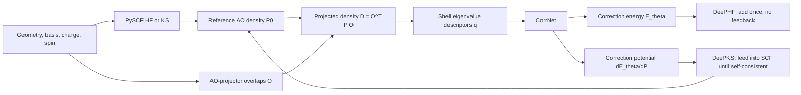

# Technical Assessment of deepks-kit Issue #93

**Issue:** [Implement exact analytic DeePHF nuclear forces and force-aware training](https://github.com/deepmodeling/deepks-kit/issues/93)  
**Repository snapshot:** [`deepmodeling/deepks-kit@4f133fb`](https://github.com/deepmodeling/deepks-kit/tree/4f133fb60e00bc5e413e80e32214defb7a145415)  
**Audit date:** 2026-08-18  
**Assessment type:** source-code, mathematical, architecture, and delivery-scope audit

This report first explains the project and its existing energy/force paths, then evaluates Issue #93. All code links are pinned to commit `4f133fb60e00bc5e413e80e32214defb7a145415`, so later changes to `master` do not alter the evidence.

The audit did not execute PySCF/Torch numerical regressions: the checked environment does not contain the project's manually installed scientific dependencies. Numerical thresholds below are therefore recommended acceptance criteria, not measured results. The central conclusion is based on direct code inspection, analytic response theory, the DeePHF/DeePKS papers, and official PySCF response implementations.

---

# Part I — What deepks-kit Is and How It Works

## 1. Purpose and scientific model

`deepks-kit` learns an orbital-density-based correction to a lower-level electronic-structure method. Its README explicitly presents two related uses: perturbative **DeePHF** and self-consistent **DeePKS**, exposed through the `train`, `test`, `scf`, `stats`, and `iterate` commands ([README, lines 1–11](https://github.com/deepmodeling/deepks-kit/blob/4f133fb60e00bc5e413e80e32214defb7a145415/README.md#L1-L11)).

Let a reference HF or KS calculation at geometry \(R\) produce an AO density matrix \(P_0(R)\). The code constructs local projected density matrices, converts their eigenvalues into descriptors \(q\), and uses a neural network to predict a correction energy \(E_\theta(q)\).

The two modes differ in where the density comes from and whether the learned potential feeds back into the orbitals:

| Mode | Density used by the model | Does the model alter the SCF equations? | Energy concept | Existing force status |
|---|---|---:|---|---|
| Base HF/KS | \(P_0\) | No | \(E_{\rm ref}\) | Native PySCF gradient |
| DeePHF | Converged reference \(P_0\) | No | \(E_{\rm ref}[P_0]+E_\theta[q(P_0)]\) | Correction-energy prediction exists; exact relaxed analytic force does not |
| DeePKS | Self-consistent corrected density \(P_\theta\) | Yes | A stationary corrected functional | Analytic self-consistent gradient path exists |

The original DeePHF paper describes the correction as a non-self-consistent functional of HF/DFT orbitals and projected density descriptors ([DeePHF paper](https://arxiv.org/abs/2005.00169)). The DeePKS-kit paper explains the transition from that perturbative model to a self-consistent learned functional and its force expression ([DeePKS-kit paper](https://arxiv.org/abs/2012.14615)). This distinction is the key to Issue #93.

## 2. End-to-end architecture

At the command-line level, installation registers both `deepks` and `dks` as aliases for `deepks.main:main_cli` ([setup.py, lines 8–33](https://github.com/deepmodeling/deepks-kit/blob/4f133fb60e00bc5e413e80e32214defb7a145415/setup.py#L8-L33)). The command dispatcher is in [`deepks/main.py`](https://github.com/deepmodeling/deepks-kit/blob/4f133fb60e00bc5e413e80e32214defb7a145415/deepks/main.py#L11-L37).

## 3. Repository composition

| Area | Main responsibility | Relevance to Issue #93 |
|---|---|---|
| `deepks/model` | Neural model, dataset reader, training, saved-data testing | Existing force loss contracts `grad_vx` with the model's descriptor gradient |
| `deepks/scf` | PySCF integration, descriptors, corrected SCF, analytic DeePKS gradients, field dumping | Contains the fixed-density `grad_vx` whose semantics are at issue |
| `deepks/iterate` | Alternating SCF data generation and model retraining | Initializes perturbative DeePHF, then iterates toward DeePKS |
| `deepks/task` | Local, SSH, Slurm, batch, and restartable task execution | Workflow infrastructure, not response theory |
| `deepks/utils` | Argument, basis, and helper utilities | Shared support code |
| `examples` | Single-water, water-cluster, iteration, training, SCF, and statistics examples | Shows that initialization training is normally energy-only |
| `scripts` | Auxiliary conversion and workflow scripts | Peripheral to analytic forces |

There is currently no dedicated `deepks/deephf` method or response subsystem. “DeePHF testing” is saved-descriptor model evaluation rather than a method object wrapping a converged PySCF calculation.

## 4. Descriptor construction

For each real atom \(I\), the code creates an atom-centered projector basis and computes the overlap between molecular AOs \(\chi_\mu\) and projectors \(\alpha_{Ip}\):

\[
O^I_{\mu p}(R)=\langle\chi_\mu(R)\mid\alpha_{Ip}(R)\rangle.
\]

It then forms the local projected density matrix

\[
D^I(R)=O^{I\,T}(R)\,P(R)\,O^I(R),
\]

diagonalizes each angular-momentum shell, and concatenates the eigenvalues into the descriptor \(q\). The implementation is in:

- projected density and shell eigenvalues: [`deepks/scf/scf.py`, lines 29–50](https://github.com/deepmodeling/deepks-kit/blob/4f133fb60e00bc5e413e80e32214defb7a145415/deepks/scf/scf.py#L29-L50);
- atom-centered ghost/projector molecule: [`scf.py`, lines 88–96](https://github.com/deepmodeling/deepks-kit/blob/4f133fb60e00bc5e413e80e32214defb7a145415/deepks/scf/scf.py#L88-L96);
- overlap caching and `make_eig`: [`scf.py`, lines 168–195](https://github.com/deepmodeling/deepks-kit/blob/4f133fb60e00bc5e413e80e32214defb7a145415/deepks/scf/scf.py#L168-L195) and [lines 222–257](https://github.com/deepmodeling/deepks-kit/blob/4f133fb60e00bc5e413e80e32214defb7a145415/deepks/scf/scf.py#L222-L257).

For unrestricted calculations, the current descriptor is constructed from the **spin-summed density** \(P_\alpha+P_\beta\), not separate spin descriptors ([`scf.py`, lines 197–211](https://github.com/deepmodeling/deepks-kit/blob/4f133fb60e00bc5e413e80e32214defb7a145415/deepks/scf/scf.py#L197-L211) and [lines 234–243](https://github.com/deepmodeling/deepks-kit/blob/4f133fb60e00bc5e413e80e32214defb7a145415/deepks/scf/scf.py#L234-L243)). Any UHF/UKS response implementation must preserve or explicitly version this choice.

## 5. Neural correction model

`CorrNet` maps per-atom descriptors to per-atom correction energies and sums them. Its principal components are:

- input shift/scale normalization;
- a linear correction branch;
- optional `TraceEmbedding` or `ThermalEmbedding`;
- a residual dense network with configurable activation;
- optional element constants and a total energy constant;
- checkpoint and TorchScript save/load support.

Code evidence is in [`deepks/model/model.py`, lines 140–210](https://github.com/deepmodeling/deepks-kit/blob/4f133fb60e00bc5e413e80e32214defb7a145415/deepks/model/model.py#L140-L210), [`CorrNet`, lines 213–274](https://github.com/deepmodeling/deepks-kit/blob/4f133fb60e00bc5e413e80e32214defb7a145415/deepks/model/model.py#L213-L274), and [save/load, lines 298–342](https://github.com/deepmodeling/deepks-kit/blob/4f133fb60e00bc5e413e80e32214defb7a145415/deepks/model/model.py#L298-L342).

In self-consistent use, PyTorch autograd gives both the correction energy and its AO-density derivative \(V_{\rm corr}=\partial E_\theta/\partial P\) ([`scf.py`, lines 53–62](https://github.com/deepmodeling/deepks-kit/blob/4f133fb60e00bc5e413e80e32214defb7a145415/deepks/scf/scf.py#L53-L62)). `CorrMixin.get_veff` adds that potential to the reference effective potential, while `energy_elec` adds the correction energy ([`scf.py`, lines 99–162](https://github.com/deepmodeling/deepks-kit/blob/4f133fb60e00bc5e413e80e32214defb7a145415/deepks/scf/scf.py#L99-L162)).

## 6. Data model, training, and testing

The dataset reader maps NumPy files such as:

- `dm_eig.npy` to descriptors;
- `l_e_delta.npy` to energy-correction labels;
- `grad_vx.npy` to descriptor-coordinate Jacobians;
- `l_f_delta.npy` to force-correction labels.

See [`deepks/model/reader.py`, lines 24–113](https://github.com/deepmodeling/deepks-kit/blob/4f133fb60e00bc5e413e80e32214defb7a145415/deepks/model/reader.py#L24-L113). The accompanying `system.raw` records only array dimensions, not the reference method, basis, projector hash, units, derivative semantics, software versions, or response tolerances ([`deepks/scf/run.py`, lines 167–194](https://github.com/deepmodeling/deepks-kit/blob/4f133fb60e00bc5e413e80e32214defb7a145415/deepks/scf/run.py#L167-L194)). This is important because an explicit and a relaxed Jacobian can have the same shape but different physics.

### 6.1 Existing force loss

Training computes

\[
g_q=\frac{\partial E_\theta}{\partial q},\qquad
F_{\theta,bx}=-\sum_{Ia} (\texttt{grad\_vx})_{bx,Ia}\,(g_q)_{Ia}.
\]

The implementation uses `torch.autograd.grad(..., create_graph=True)` and then `-einsum(gvx, gev)` ([`deepks/model/train.py`, lines 108–139](https://github.com/deepmodeling/deepks-kit/blob/4f133fb60e00bc5e413e80e32214defb7a145415/deepks/model/train.py#L108-L139)). This computational pattern is reusable for exact DeePHF force training **if and only if** `gvx` is replaced by the correct relaxed Jacobian.

### 6.2 Energy-only evaluation path

The training-time validation evaluator is hard-coded to energy-only even when the training loss uses forces ([`train.py`, lines 165–178](https://github.com/deepmodeling/deepks-kit/blob/4f133fb60e00bc5e413e80e32214defb7a145415/deepks/model/train.py#L165-L178)). The `deepks test` path also reads descriptors and energy labels only, calls `model(eig)`, and reports energy error; it neither computes forces nor reruns a reference SCF ([`deepks/model/test.py`, lines 18–80](https://github.com/deepmodeling/deepks-kit/blob/4f133fb60e00bc5e413e80e32214defb7a145415/deepks/model/test.py#L18-L80)).

The examples support the narrower statement that DeePHF **initialization training** is energy-only:

- [`examples/water_single/init/params.yaml`, lines 17–54](https://github.com/deepmodeling/deepks-kit/blob/4f133fb60e00bc5e413e80e32214defb7a145415/examples/water_single/init/params.yaml#L17-L54);
- [`examples/iterate/combined.yaml`, lines 89–123](https://github.com/deepmodeling/deepks-kit/blob/4f133fb60e00bc5e413e80e32214defb7a145415/examples/iterate/combined.yaml#L89-L123);
- [`examples/water_cluster/README.md`, lines 25–37](https://github.com/deepmodeling/deepks-kit/blob/4f133fb60e00bc5e413e80e32214defb7a145415/examples/water_cluster/README.md#L25-L37).

However, Issue #93 overstates this slightly: the water-cluster initialization configuration still dumps `f_base`, `f_tot`, `grad_vx`, and `l_f_delta`; those fields are simply not used because initialization training has no force factor ([`examples/water_cluster/args.yaml`, lines 127–189](https://github.com/deepmodeling/deepks-kit/blob/4f133fb60e00bc5e413e80e32214defb7a145415/examples/water_cluster/args.yaml#L127-L189)).

## 7. Self-consistent DeePKS and its current force path

The restricted and unrestricted implementations inherit PySCF `RKS` and `UKS`; setting `xc="HF"` gives the HF-like cases ([`deepks/scf/scf.py`, lines 265–292](https://github.com/deepmodeling/deepks-kit/blob/4f133fb60e00bc5e413e80e32214defb7a145415/deepks/scf/scf.py#L265-L292)). In the corrected method, \(V_{\rm corr}\) participates in every SCF cycle. At convergence, the total corrected functional is stationary with respect to orbital variations.

The current `t_make_grad_pdm_x` accepts an ordinary, fixed AO density matrix and differentiates only AO-projector overlap terms and projector-center motion ([`deepks/scf/grad.py`, lines 41–61](https://github.com/deepmodeling/deepks-kit/blob/4f133fb60e00bc5e413e80e32214defb7a145415/deepks/scf/grad.py#L41-L61)). `t_make_grad_eig_x` then contracts that derivative with the eigenvalue Jacobian to produce `grad_vx` ([lines 64–73](https://github.com/deepmodeling/deepks-kit/blob/4f133fb60e00bc5e413e80e32214defb7a145415/deepks/scf/grad.py#L64-L73)). There is no CPHF/CPKS solve and no \(dP/dR\) in this code.

For **self-consistent DeePKS**, that is intentional. The inherited PySCF gradient supplies the reference-functional and ordinary AO-overlap/Pulay structure at the self-consistent density; the correction adds its explicit projector/AO derivative ([`grad.py`, lines 76–113](https://github.com/deepmodeling/deepks-kit/blob/4f133fb60e00bc5e413e80e32214defb7a145415/deepks/scf/grad.py#L76-L113), [129–160](https://github.com/deepmodeling/deepks-kit/blob/4f133fb60e00bc5e413e80e32214defb7a145415/deepks/scf/grad.py#L129-L160), and [217–254](https://github.com/deepmodeling/deepks-kit/blob/4f133fb60e00bc5e413e80e32214defb7a145415/deepks/scf/grad.py#L217-L254)). Orbital-response terms cancel through stationarity of the **full corrected** functional. This does not mean `grad_vx` alone contains every Pulay term; it means the complete variational gradient decomposition does not require a separate response solve.

## 8. CLI, iteration workflow, and current limitations

`deepks scf` currently chooses the mode implicitly:

- no model: base calculation;
- a model file: self-consistent corrected calculation.

There is no explicit `base | deephf | deepks` selector ([`deepks/scf/run.py`, lines 197–213](https://github.com/deepmodeling/deepks-kit/blob/4f133fb60e00bc5e413e80e32214defb7a145415/deepks/scf/run.py#L197-L213)). `solve_mol` creates the package's corrected SCF classes and evaluates gradients only when requested fields require them ([`run.py`, lines 36–76](https://github.com/deepmodeling/deepks-kit/blob/4f133fb60e00bc5e413e80e32214defb7a145415/deepks/scf/run.py#L36-L76)).

The iteration driver performs a base-SCF data-generation stage, trains an initial correction model, then repeatedly runs self-consistent DeePKS with the previous model and retrains ([`deepks/iterate/iterate.py`, lines 133–217](https://github.com/deepmodeling/deepks-kit/blob/4f133fb60e00bc5e413e80e32214defb7a145415/deepks/iterate/iterate.py#L133-L217) and [250–316](https://github.com/deepmodeling/deepks-kit/blob/4f133fb60e00bc5e413e80e32214defb7a145415/deepks/iterate/iterate.py#L250-L316)). The task layer supplies local/SSH/Slurm orchestration and restart records.

One important scope limitation is hidden in the runner: `build_mol` unconditionally resets `mol.spin` to `nelectron % 2` after applying user arguments ([`run.py`, lines 140–155](https://github.com/deepmodeling/deepks-kit/blob/4f133fb60e00bc5e413e80e32214defb7a145415/deepks/scf/run.py#L140-L155)). The CLI therefore naturally represents even-electron singlets and odd-electron doublets, not arbitrary UHF/UKS high-spin references. The underlying class structure is broader than the current runner contract.

## 9. Maturity and maintenance context

As of the audit date:

- the latest `master` commit is the 2025-04-29 `fock_last` compatibility fix [`4f133fb`](https://github.com/deepmodeling/deepks-kit/commit/4f133fb60e00bc5e413e80e32214defb7a145415);
- the public tags are old (`v0.0` and `v0.1`), and there is no current GitHub Release ([releases/tags](https://github.com/deepmodeling/deepks-kit/releases));
- the default branch has no test suite; its GitHub Actions workflow only mirrors to Gitee;
- `setup.py` deliberately omits PyTorch and PySCF from `install_requires` and does not pin their versions ([setup.py, lines 8–27](https://github.com/deepmodeling/deepks-kit/blob/4f133fb60e00bc5e413e80e32214defb7a145415/setup.py#L8-L27));
- prior compatibility issues exist, including [Issue #89](https://github.com/deepmodeling/deepks-kit/issues/89);
- a maintainer stated in [Issue #82](https://github.com/deepmodeling/deepks-kit/issues/82#issuecomment-2489727956) that maintenance was postponed while contributions remained welcome.

This matters for Issue #93's schedule: response theory will rely on internal PySCF conventions and needs a version matrix and CI before four reference types can credibly be called production-ready.

---

# Part II — Assessment of Issue #93

## 10. What the issue proposes

[Issue #93](https://github.com/deepmodeling/deepks-kit/issues/93) proposes to add exact analytic forces for perturbative DeePHF and make those forces usable in training. Its major claims and design choices are:

1. the existing fixed-density `grad_vx` is incomplete for perturbative DeePHF;
2. the missing term is the HF/KS orbital/density response to nuclear displacement;
3. direct CP-HF/CPKS should generate a model-independent relaxed descriptor Jacobian for training;
4. a Z-vector/adjoint solve should provide efficient scalar-energy forces for inference;
5. the implementation should wrap an already-converged native PySCF `mf` object rather than reuse the self-consistent DeePKS class;
6. data fields and metadata must distinguish explicit and relaxed Jacobians;
7. CLI modes, force evaluation, regression tests, and documentation should be added.

The issue was opened on 2026-08-10 by `njzjz-bot`; its body says it was generated with Codex. At the audit date it is open with no assignee, label, milestone, maintainer comment, linked implementation PR, or public review. This provenance does not make the proposal wrong, but it means the issue is an unreviewed technical design rather than an accepted maintainer roadmap.

## 11. The current-code diagnosis is correct

Holding the AO density matrix fixed, the present code differentiates

\[
D^I=O^{I\,T} P O^I
\]

as

\[
\left(\frac{dD^I}{dR_A}\right)_{P}
=
\frac{dO^{I\,T}}{dR_A} P O^I
+
O^{I\,T}P\frac{dO^I}{dR_A}.
\]

For a perturbative reference density \(P_0(R)\), the full derivative is instead

\[
\frac{dD^I}{dR_A}
=
\frac{dO^{I\,T}}{dR_A}P_0O^I
+
O^{I\,T}\frac{dP_0}{dR_A}O^I
+
O^{I\,T}P_0\frac{dO^I}{dR_A}.
\]

The middle term is absent from `t_make_grad_pdm_x`. There is no CPHF, CPKS, coupled orbital-response, or relaxed density builder elsewhere in this path. Consequently:

> Existing `grad_vx` is an **explicit, fixed-AO-density descriptor derivative**, not the relaxed DeePHF descriptor derivative.

This confirms the issue's primary code-level premise.

It is also important to phrase the impact accurately. The repository does not currently expose a public “exact DeePHF force” command that silently computes a wrong result. The main situation is a **missing DeePHF-force feature plus ambiguous legacy Jacobian semantics**. If a user manually treats legacy `grad_vx` as a perturbative DeePHF force Jacobian, the force is generally incomplete.

Special cases where the omitted contraction can vanish include a constant/zero correction, a zero correction gradient with respect to density, an accidental cancellation, or orbitals that are stationary for the corrected functional. The last case is the self-consistent DeePKS limit, not ordinary DeePHF.

## 12. Why DeePHF needs response but DeePKS does not

Let \(x\) denote independent occupied–virtual orbital-rotation variables for the reference SCF problem. The reference stationarity equation is

\[
r(x,R)=\frac{\partial E_{\rm ref}}{\partial x}=0.
\]

Define

\[
A=\frac{\partial r}{\partial x},\qquad
B_A=\frac{\partial r}{\partial R_A}.
\]

Implicit differentiation gives

\[
A x^{R_A}=-B_A.
\]

The DeePHF energy is

\[
E_{\rm DeePHF}(R)
=E_{\rm ref}[P_0(R),R]
+E_\theta[q(P_0(R),R)].
\]

Reference stationarity removes an explicit orbital-response term from \(dE_{\rm ref}/dR_A\), but not from the correction, because \(E_\theta\) did not participate in the reference SCF equations:

\[
\frac{dE_\theta}{dR_A}
=
\frac{\partial E_\theta}{\partial q}^{T}
\left[
\left(\frac{\partial q}{\partial R_A}\right)_{P}
+
\frac{\partial q}{\partial P}:\frac{dP_0}{dR_A}
\right].
\]

Therefore

\[
J_{\rm relaxed}
=
\frac{dq}{dR}
=J_{\rm explicit}+J_{\rm response},
\qquad
J_{\rm response}=q_P:P_0^R,
\]

and

\[
F_{\rm total}=F_{\rm ref}-J_{\rm relaxed}^{T}\nabla_q E_\theta.
\]

By contrast, DeePKS solves orbitals with \(V_{\rm corr}=\partial E_\theta/\partial P\) included. The **full corrected functional** is stationary, so its first derivative can be evaluated without explicitly solving for orbital response. This is the same variational/nonvariational distinction emphasized in the molecular-orbital machine-learning gradient literature ([analytical gradients for MO-based ML](https://arxiv.org/abs/2012.08899)).

## 13. Direct CP-HF/CPKS backend

The direct route solves one response problem for every independent nuclear perturbation:

\[
A x^{R_A}=-B_A.
\]

From the first-order orbitals it builds the full AO density response \(P_0^{R_A}\), then contracts with \(q_P\). This is the correct route for generating a model-independent relaxed descriptor Jacobian that can be stored and reused across neural-network parameter updates.

The issue is right to recommend reusing PySCF's response machinery. Official PySCF code exposes:

- RHF nuclear-response batching in [`pyscf.hessian.rhf.solve_mo1`](https://pyscf.org/_modules/pyscf/hessian/rhf.html#solve_mo1);
- overlap-aware CPHF in [`pyscf.scf.cphf.solve_withs1`](https://pyscf.org/_modules/pyscf/scf/cphf.html#solve_withs1);
- unrestricted CPHF in [`pyscf.scf.ucphf`](https://pyscf.org/_modules/pyscf/scf/ucphf.html);
- HF/DFT response kernels in [`pyscf.scf._response_functions`](https://pyscf.org/_modules/pyscf/scf/_response_functions.html).

However, implementation must use the complete first-order MO coefficients. In a nonorthogonal AO basis, differentiating \(C^TSC=I\) gives

\[
U^R+U^{R\,T}=-S_{\rm MO}^{R}.
\]

PySCF's overlap-aware CPHF therefore includes the occupied–occupied metric contribution \(U^R_{ij}=-S^R_{ij}/2\). Building \(P^R\) from only occupied–virtual amplitudes is incomplete. A direct implementation that constructs \(P^R\) from PySCF's full `mo1` can include this automatically.

The direct backend should also compute and report its own CP residual. PySCF's low-level CPHF return value is a solution, not a universally available explicit convergence flag. Silent use of an unconverged response is incompatible with the issue's “exact” goal.

## 14. Z-vector backend: correct strategy, incomplete specification

For one scalar correction energy, define the correction orbital gradient

\[
b=\frac{\partial E_\theta}{\partial x}.
\]

Instead of solving \(A x^{R_A}=-B_A\) for all \(3N\) perturbations, solve the adjoint equation once:

\[
A^T z=b.
\]

Then the occupied–virtual response contribution becomes

\[
b^T x^{R_A}=-z^T B_A.
\]

This is mathematically equivalent to the direct method when both use identical variable, occupation, transpose, metric, and perturbation conventions. It is the right inference architecture and follows standard Z-vector theory ([Handy–Schaefer](https://doi.org/10.1063/1.447489)). The issue is also right not to assume that PySCF's implemented/preconditioned operator can be transposed merely by treating it as a symmetric matrix.

### Missing detail: the correction-specific AO metric term

The issue's Z-vector recipe is not yet a complete strict formula. In a nonorthogonal AO basis, \(V_{\rm corr}:P^R\) contains both:

1. the occupied–virtual response eliminated by the Z-vector; and
2. an occupied–occupied overlap/orthonormality contribution involving \(S^R\).

The second term must remain explicitly, or be represented by an equivalent energy-weighted-density/Lagrangian overlap contraction. It is not the same as the projector–AO overlap derivative already called “explicit” in `grad_vx`. Restricted and unrestricted occupation conventions change the coefficient and spin decomposition, so the implementation should derive it from a single documented Lagrangian convention rather than copy a heuristic factor.

A safe top-level decomposition is

\[
\frac{dE_\theta}{dR_A}
=E_{\theta,\,\text{projector/AO-explicit}}^{R_A}
+E_{\theta,\,\text{AO-metric}}^{R_A}
-z^T B_A.
\]

PySCF's post-SCF gradient implementations provide useful examples of explicit overlap/energy-weighted-density contractions, e.g. [`pyscf.grad.mp2`](https://pyscf.org/_modules/pyscf/grad/mp2.html). Direct and Z-vector results must agree after **all three** contributions are included.

## 15. Why a stored relaxed Jacobian enables force training

If the reference method, geometry, basis, projector basis, occupations, and numerical settings are fixed, and only neural parameters \(\theta\) are trained, then

\[
J_{\rm relaxed}(R)=\frac{dq(P_0(R),R)}{dR}
\]

does not depend on \(\theta\). Force training can therefore use

\[
F_\theta=-J_{\rm relaxed}^{T}\nabla_q E_\theta
\]

and differentiate it with respect to \(\theta\) using mixed neural-network derivatives. The existing `create_graph=True` implementation already supports this pattern. PySCF itself need not be embedded in the Torch graph.

Two qualifications are necessary:

- if projector parameters become trainable, the stored Jacobian is no longer parameter-independent;
- twice-continuously differentiable activations are a strong sufficient condition, not a universal mathematical necessity. ReLU can be differentiated almost everywhere by autodiff, but gives discontinuous forces and undefined kinks. Smooth activations such as GELU or Softplus should be required for stable physical forces and higher-order training, while the issue should avoid claiming that \(C^2\) is the only possible formal choice.

## 16. Claim-by-claim verdict

| Issue claim or proposal | Verdict | Audit finding |
|---|---|---|
| DeePHF energy training exists | Correct | Saved reference descriptors and correction labels train `CorrNet` |
| `deepks test` is energy-only | Correct | It does not read force fields or rerun SCF |
| DeePKS has an analytic self-consistent force path | Correct, with maturity caveat | The path exists but has no default-branch regression suite |
| Existing force loss is `-grad_vx · dE/deig` | Correct | Matches `train.py` exactly |
| Existing `grad_vx` holds AO density fixed | Correct | Only AO/projector overlap motion is differentiated |
| That Jacobian is incomplete for perturbative DeePHF | Correct | \(q_P:P_0^R\) is absent |
| Exact DeePHF forces require CP-HF/CPKS response | Correct | Standard nonvariational orbital-response result |
| Direct CP can generate a reusable relaxed Jacobian | Correct | Reference response is independent of NN weights under fixed projectors |
| One Z-vector can replace \(3N\) direct solves for scalar energy | Correct in principle | Must include the AO metric term and verified transpose convention |
| Compose a DeePHF object around converged native `mf` | Correct | Prevents accidental feedback that would change the problem into DeePKS |
| Refactor shared descriptor logic | Correct | Current overlap/cache/descriptor/gradient logic spans SCF mixins |
| Introduce explicit mode selection | Correct | Current model-file presence only distinguishes base from self-consistent use |
| Existing examples generate and train only energies | Partly correct | Training is energy-only; at least one initialization config still dumps force-related fields |
| Current runner supports RHF/UHF/RKS/UKS generally | Overbroad | Classes cover restricted/unrestricted forms, but CLI overrides spin and many reference variants are unspecified |
| Warnings are enough for descriptor degeneracy | Incorrect/incomplete | Individual ordered eigenvalue Jacobians may not exist at exact degeneracy |
| Smooth/second-order-capable NN path is needed | Directionally correct | Smooth activations should be required for robust forces; strict \(C^2\) necessity is overstated |
| Full four-reference implementation in 3–5 weeks | Optimistic | Grid response, unrestricted conventions, CI, compatibility, data migration, and performance make this a multi-stage subsystem |
| “Exact analytic force” without further domain qualifiers | Too broad | Exact only for the defined approximate model and within supported differentiable, stable reference conditions |

## 17. Conditions missing from “strict exact analytic”

### 17.1 Descriptor eigenvalue degeneracy

The raw descriptor is a vector of ordered shell eigenvalues. At an exactly repeated eigenvalue, the map from a Hermitian matrix to its **individual ordered eigenvalues** is generally not Fréchet differentiable: different perturbation directions split the degenerate subspace differently. A unique model-independent tensor \(dq/dR\) may therefore not exist.

A warning followed by an arbitrary eigenvector derivative is insufficient for a strict force claim. The implementation must choose one of these contracts:

1. reject geometries with exact/near descriptor degeneracy in the initial supported domain;
2. replace raw eigenvalues with smooth spectral invariants such as traces/power sums;
3. constrain the energy to a differentiable symmetric spectral function and differentiate the contracted energy/subspace expression rather than store an ambiguous individual-eigenvalue Jacobian.

The existing trace/thermal embeddings may help construct permutation-symmetric spectral features, but ordinary dense processing of sorted eigenvalues does not guarantee equal sensitivities inside a degenerate block. The distinction must be tested, not inferred from `eigvalsh` being available in PyTorch. A mathematical treatment of repeated-eigenvalue derivatives is given by [Andrew and Tan](https://doi.org/10.1137/S0895479896304332).

This also affects the issue's proposed test systems. High-symmetry H\(_2\) or linear molecules can produce symmetry-induced descriptor degeneracies. Low-symmetry systems such as LiH or a deliberately distorted triatomic are safer first derivative fixtures. High-symmetry cases should be retained as explicit degeneracy-contract tests.

### 17.2 KS numerical-grid response

RKS/UKS response is not “HF response plus an XC kernel” only. Nuclear displacement also changes AO values on the grid, atom-centered grid coordinates, partition weights, and potentially pruning/reconstruction decisions. PySCF's `mf.gen_response` supplies the induced electronic response, including supported XC kernels ([official response source](https://pyscf.org/_modules/pyscf/scf/_response_functions.html)), but it is not by itself the entire nuclear perturbation RHS.

PySCF's RKS gradient has a separate `grid_response` option and `extra_force` path ([official RKS gradient source](https://pyscf.org/_modules/pyscf/grad/rks.html)). The feature specification must state whether it targets the continuous quadrature limit or the derivative of a particular discretized grid energy, and reference force, CP RHS, and finite-difference calculations must use consistent grid settings.

“RKS/UKS” should initially mean an explicit, tested support matrix—for example conventional LDA/GGA/global-hybrid cases with deterministic dense grids—not every meta-GGA, NLC, range-separated hybrid, custom functional, or pruned-grid configuration.

### 17.3 Occupations, gaps, and SCF-root continuity

The standard PySCF CPHF/UCPHF interfaces assume ordinary occupied/virtual partitions. Fractional occupations or smearing add occupation-number and chemical-potential response; metallic or zero-gap cases can make the orbital Hessian singular. A converged SCF energy is not proof that its response is well conditioned.

The first supported domain should require:

- RHF/RKS occupations in \(\{0,2\}\);
- UHF/UKS occupations in \(\{0,1\}\) per spin;
- no occupation switching across finite-difference displacements;
- a stable, gapped reference and acceptable CP residual;
- continuous tracking of the same SCF root.

ROHF/ROKS, smearing/fractional occupations, complex orbitals, periodic systems, and state crossings should be rejected explicitly until separately implemented.

### 17.4 Unrestricted spin semantics

Because current descriptors use \(P_\alpha+P_\beta\), the relaxed response must be

\[
J_{\rm response}=q_P:(P_\alpha^R+P_\beta^R).
\]

The same correction potential acts in both spin channels, while UCPHF/UKS responses remain coupled through Coulomb and, for UKS, cross-spin XC kernels. They are not two independent restricted response solves. Tests must compare both spin-resolved responses and their sum, and the CLI must stop overwriting an explicitly supplied spin.

### 17.5 Unsupported PySCF variants

A wrapper accepting an arbitrary converged `mf` object could accidentally appear to support more than it does. Density fitting, ECP-specific terms, solvent, QM/MM, external fields, custom SCF wrappers, noncollinear/spinor orbitals, PBC, symmetry-enforced occupations, and scanner subclasses all change derivative or cache semantics. The API should use capability checks and fail early for unverified combinations.

## 18. Data and API changes that should be required

### 18.1 Unambiguous fields

The legacy name `grad_vx` must not be silently reinterpreted. Prefer names such as:

- `dq_dR_explicit` — fixed-AO-density descriptor derivative;
- `dq_dR_response` — density-response contribution;
- `dq_dR_relaxed` — their verified sum.

If compatibility requires the issue's `grad_vx_*` names, readers should still require a semantics version. Do not silently fall back from relaxed to legacy explicit data when force training is enabled.

For energies, prefer `e_base`, `e_corr`, and `e_tot`; `e_ref` is easy to confuse with the existing high-level reference-label meaning of `l_e_ref`.

### 18.2 Required provenance

Every response dataset should include at least:

- data semantics/schema version and sign convention;
- reference class, XC functional, basis, ECP, charge, spin, occupations;
- projector-basis content/hash and spin-summed versus spin-resolved descriptor choice;
- geometry, coordinate unit, atom ordering, moved-atom list, and ghost-center policy;
- PySCF, PyTorch, deepks-kit version/commit, dtype, and platform;
- SCF tolerance, convergence status, stability/root checks;
- CP tolerance, iteration count, residual norm, and failure status;
- DFT grid level, pruning, grid-response setting, and integration details;
- direct/Z backend identity and descriptor-degeneracy diagnostic.

### 18.3 Storage scaling

With the current shape `(frame, displaced_atom, xyz, descriptor_atom, nproj)`, full relaxed-Jacobian storage is quadratic in atom count. If each atom has 108 descriptors, one float64 frame costs approximately

\[
3N\times108N\times8 = 2592N^2\ \text{bytes}.
\]

Approximate decimal sizes are:

| Atoms | One frame | 10,000 frames |
|---:|---:|---:|
| 10 | 0.26 MB | 2.6 GB |
| 30 | 2.33 MB | 23 GB |
| 100 | 25.9 MB | 259 GB |
| 300 | 233 MB | 2.33 TB |

Storing explicit and response arrays separately can multiply this cost. The current NumPy reader eagerly loads arrays, so coordinate batching alone does not solve dataset memory pressure. The design should include chunked/lazy storage, precision and compression policy, and possibly on-demand Jacobian-vector/vector-Jacobian alternatives for large systems.

## 19. Recommended implementation sequence

Issue #93 should be treated as an umbrella epic with reviewable phases rather than one large PR.

### Phase 0 — Freeze semantics and create a compatibility test bed

- confirm the canonical repository and target branch before beginning a cross-cutting refactor;
- pin a supported PySCF range and install matrix;
- add CI and native PySCF energy/gradient smoke tests;
- define field schema, force signs, units, occupations, atom lists, spin semantics, and unsupported cases;
- extract shared descriptor construction and cache invalidation without changing results.

### Phase 1 — RHF direct-response reference implementation

- accept only a converged, stable, integer-occupation RHF object;
- use PySCF nuclear perturbation `h1`/`s1` and overlap-aware CPHF;
- build full \(P^R\), including occupied–occupied metric response;
- generate explicit, response, and relaxed Jacobians;
- fail on CP residual or descriptor-degeneracy violations;
- validate on low-symmetry molecules with double precision.

This is the minimum scientifically useful MVP and the best oracle for later work.

### Phase 2 — RHF Z-vector inference

- derive the correction orbital RHS from \(V_{\rm corr}\);
- implement and verify the actual transpose action;
- include the correction-specific AO metric term;
- compare every contribution and the total against Phase 1 and finite differences;
- add geometry-scanner cache invalidation tests.

### Phase 3 — Force-aware data, training, testing, and CLI

- enforce `dq_dR_relaxed` for DeePHF force training;
- report energy and force metrics separately;
- add explicit `base | deephf | deepks` mode selection;
- implement `energy()`, `forces(backend=...)`, and safe `as_scanner()` behavior;
- add chunked/lazy dataset support and migration documentation.

### Phase 4 — UHF

- preserve spin-summed descriptor semantics;
- implement coupled alpha/beta response and metric terms;
- expose arbitrary user spin instead of overriding it;
- test open-shell, nondegenerate systems and reject ROHF/fractional occupations.

### Phase 5 — RKS/UKS by explicit XC support tier

- reuse matching PySCF Hessian nuclear-RHS logic rather than only `gen_response`;
- define grid-response/pruning semantics;
- add LDA/GGA/hybrid cases one tier at a time;
- validate dense-grid finite differences and direct/Z agreement before expanding support.

## 20. Acceptance matrix

| Level | Test | Required observation |
|---|---|---|
| Reference | Zero/constant correction | Total force equals native reference force |
| Descriptor | Fixed-density explicit derivative | Matches frozen-density finite difference |
| CP density | \(P^R\) versus independently converged displaced SCFs | Density response agrees in a gauge-invariant AO comparison |
| Relaxed descriptor | \(dq/dR\) versus displaced reference SCFs | Central differences converge with step-size reduction |
| Backend | Direct versus Z-vector | Agreement after explicit, metric, and response terms are all included |
| Total energy | Analytic force versus central difference of \(E_{\rm ref}+E_\theta\) | Method-appropriate convergence over multiple steps |
| Training | Autodiff parameter gradient of force loss | Matches parameter finite differences |
| Symmetry | Translation and rotation | Near-zero net force and net torque within numerical tolerance |
| UHF/UKS | Spin-resolved response | \(P_\alpha^R\), \(P_\beta^R\), and their sum are consistent |
| DFT | Grid convergence | Error plateaus consistently as grid is tightened; settings are recorded |
| Robustness | Unconverged CP, root switch, small gap, degeneracy | Explicit failure or documented guarded behavior; never silent fallback |
| Scanner | Repeated geometry calls | All overlap, projector, grid, response, and model caches invalidate correctly |
| Data | Legacy explicit Jacobian supplied to DeePHF force training | Hard error unless an explicit migration/conversion is performed |

The issue's `1e-8 Eh/Bohr` direct/Z target is plausible as an internal double-precision RHF agreement goal, but it should not be a universal finite-difference requirement. DFT grid noise, finite-difference truncation/cancellation, SCF thresholds, and near-singular response require method-specific tolerances and step-size studies.

## 21. Schedule assessment

The proposed **1–2 weeks for an RHF direct proof of concept** is plausible for a developer already fluent in PySCF response internals, if the scope excludes production data migration, scanner behavior, degeneracies, and broad compatibility.

The proposed **3–5 weeks for RHF/UHF/RKS/UKS, direct and Z-vector backends, data schema, force training/testing, CLI, scanner, CI, documentation, and robust failure handling** is not a defensible production estimate for the repository's present test and dependency state.

A risk-adjusted single-expert estimate is approximately:

| Deliverable | Plausible effort | Main uncertainty |
|---|---:|---|
| Experimental RHF direct prototype | 1–3 weeks | PySCF convention mapping |
| Production RHF direct + Z + scanner | 3–6 cumulative weeks | AO metric, adjoint, cache and regression work |
| Data/training/CLI/CI integration | 1–3 additional weeks | Schema migration and storage |
| UHF support | 1–3 additional weeks | Coupled spin conventions and high-spin runner |
| Tested RKS/UKS support tiers | 3–6 additional weeks | XC kernels, nuclear RHS, grids and functional coverage |
| Full issue at production quality | Roughly 8–16 weeks total | Review availability and declared support surface |

These are planning ranges, not delivery promises. Scope can be reduced substantially by shipping RHF direct first and explicitly rejecting unsupported references.

## 22. Final judgment

### Is the improvement topic correct?

**Yes—the core scientific problem, code diagnosis, and direct/Z-vector solution direction are correct with high confidence.** Current `grad_vx` is a fixed-density explicit derivative. It is appropriate inside the existing variational DeePKS gradient decomposition, but it is not the complete relaxed descriptor derivative required for perturbative DeePHF forces. CP-HF/CPKS response is the correct missing physics/mathematics, and a stored relaxed Jacobian is a sound way to enable force-aware neural training without differentiating through PySCF.

### Is Issue #93 ready to implement exactly as written?

**No. It is a strong umbrella design, not yet a complete “strict exact analytic” specification.** Before that label is justified, the issue should explicitly add:

1. the correction-specific AO overlap/orthonormality term in the Z-vector formulation;
2. a hard contract for descriptor eigenvalue degeneracy;
3. DFT numerical-grid and nuclear-RHS semantics;
4. integer-occupation, gap, SCF-stability, and root-continuity limits;
5. unrestricted spin-summed descriptor semantics and general-spin runner support;
6. capability checks for unsupported PySCF variants;
7. chunked/lazy handling of the quadratic-size relaxed Jacobian;
8. a staged delivery plan and a longer full-scope estimate.

The most accurate classification is therefore:

> **Scientifically correct and worth implementing; architecturally sound at the high level; incomplete in several strict derivative details; broader and more expensive than the issue's schedule suggests.**

“Exact” should always mean the exact analytic derivative of the **defined approximate DeePHF model** within its documented domain—not an exact physical or high-level ab initio force.

---

## Primary sources and evidence index

- [Issue #93](https://github.com/deepmodeling/deepks-kit/issues/93)
- [Audited repository commit](https://github.com/deepmodeling/deepks-kit/tree/4f133fb60e00bc5e413e80e32214defb7a145415)
- [DeePHF: Machine Learning Many-Electron Correlation Energy from Molecular Orbitals](https://arxiv.org/abs/2005.00169)
- [DeePKS-kit: a package for developing machine learning-based energy and density functional models](https://arxiv.org/abs/2012.14615)
- [DeePKS self-consistent model and force derivation](https://arxiv.org/abs/2008.00167)
- [Analytical Gradients for Molecular-Orbital-Based Machine Learning](https://arxiv.org/abs/2012.08899)
- [PySCF RHF Hessian/CPHF implementation](https://pyscf.org/_modules/pyscf/hessian/rhf.html)
- [PySCF CPHF implementation](https://pyscf.org/_modules/pyscf/scf/cphf.html)
- [PySCF UCPHF implementation](https://pyscf.org/_modules/pyscf/scf/ucphf.html)
- [PySCF HF/DFT response functions](https://pyscf.org/_modules/pyscf/scf/_response_functions.html)
- [PySCF RKS gradient implementation](https://pyscf.org/_modules/pyscf/grad/rks.html)
- [Handy–Schaefer Z-vector paper](https://doi.org/10.1063/1.447489)
- [Pulay's analytic force/overlap foundation](https://doi.org/10.1080/00268976900100941)
- [Repeated-eigenvalue derivative analysis](https://doi.org/10.1137/S0895479896304332)
