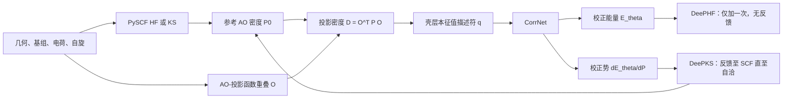

# deepks-kit Issue #93 技术评估

**议题：** [实现严格解析 DeePHF 核力并支持力感知训练](https://github.com/deepmodeling/deepks-kit/issues/93)  
**仓库快照：** [`deepmodeling/deepks-kit@4f133fb`](https://github.com/deepmodeling/deepks-kit/tree/4f133fb60e00bc5e413e80e32214defb7a145415)  
**审计日期：** 2026-08-18  
**评估类型：** 源码、数学、架构和交付范围审计

本报告先说明项目及其现有能量/力计算路径，再评估 Issue #93。所有代码链接均固定至提交 `4f133fb60e00bc5e413e80e32214defb7a145415`，因此后续对 `master` 的更改不会改变证据。

审计未执行 PySCF/Torch 数值回归：所检查的环境未安装项目需手动安装的科学计算依赖。以下数值阈值因而是建议的验收标准，并非实测结果。核心结论基于直接源码检查、解析响应理论、DeePHF/DeePKS 论文和 PySCF 官方响应实现。

---

# 第一部分——deepks-kit 是什么，以及它如何工作

## 1. 目的与科学模型

`deepks-kit` 学习对较低级电子结构方法的、基于轨道密度的校正。其 README 明确给出了两种相关用途：微扰式 **DeePHF** 与自洽式 **DeePKS**，并通过 `train`、`test`、`scf`、`stats` 和 `iterate` 命令提供功能（[README，第 1–11 行](https://github.com/deepmodeling/deepks-kit/blob/4f133fb60e00bc5e413e80e32214defb7a145415/README.md#L1-L11)）。

设几何构型 $R$ 下的参考 HF 或 KS 计算产生 AO 密度矩阵 $P_0(R)$。代码构造局域投影密度矩阵，将其本征值转换为描述符 $q$，并使用神经网络预测校正能量 $E_\theta(q)$。

两种模式的差异在于密度来源，以及学习到的势是否反馈至轨道：

| 模式 | 模型使用的密度 | 模型是否改变 SCF 方程？ | 能量概念 | 现有力的状态 |
|---|---|---:|---|---|
| 基础 HF/KS | $P_0$ | 否 | $E_{\rm ref}$ | 原生 PySCF 梯度 |
| DeePHF | 收敛的参考 $P_0$ | 否 | $E_{\rm ref}[P_0]+E_\theta[q(P_0)]$ | 已可预测校正能量；尚无严格的弛豫解析力 |
| DeePKS | 自洽校正密度 $P_\theta$ | 是 | 一个驻定的校正泛函 | 已存在解析自洽梯度路径 |

原始 DeePHF 论文将校正描述为 HF/DFT 轨道和投影密度描述符的非自洽泛函（[DeePHF 论文](https://arxiv.org/abs/2005.00169)）。DeePKS-kit 论文说明了从该微扰模型转变为自洽学习泛函及其力表达式的过程（[DeePKS-kit 论文](https://arxiv.org/abs/2012.14615)）。该区别是 Issue #93 的关键。

## 2. 端到端架构

在命令行层面，安装会将 `deepks` 和 `dks` 都注册为 `deepks.main:main_cli` 的别名（[setup.py，第 8–33 行](https://github.com/deepmodeling/deepks-kit/blob/4f133fb60e00bc5e413e80e32214defb7a145415/setup.py#L8-L33)）。命令分发器位于 [`deepks/main.py`](https://github.com/deepmodeling/deepks-kit/blob/4f133fb60e00bc5e413e80e32214defb7a145415/deepks/main.py#L11-L37)。

## 3. 仓库组成

| 区域 | 主要职责 | 与 Issue #93 的相关性 |
|---|---|---|
| `deepks/model` | 神经模型、数据集读取器、训练、保存数据测试 | 现有力损失将 `grad_vx` 与模型的描述符梯度收缩 |
| `deepks/scf` | PySCF 集成、描述符、校正 SCF、解析 DeePKS 梯度、场导出 | 包含语义存在争议的固定密度 `grad_vx` |
| `deepks/iterate` | 交替进行 SCF 数据生成与模型重训练 | 先初始化微扰 DeePHF，随后迭代转向 DeePKS |
| `deepks/task` | 本地、SSH、Slurm、批处理和可重启任务执行 | 工作流基础设施，而非响应理论 |
| `deepks/utils` | 参数、基组和辅助工具 | 共用支撑代码 |
| `examples` | 单水、水团簇、迭代、训练、SCF 和统计示例 | 表明初始化训练通常仅使用能量 |
| `scripts` | 辅助转换和工作流脚本 | 对解析力属于外围部分 |

目前不存在专用的 `deepks/deephf` 方法或响应子系统。“DeePHF 测试”是保存的描述符模型评估，而不是封装已收敛 PySCF 计算的方法对象。

## 4. 描述符构造

对每个真实原子 $I$，代码创建以原子为中心的投影函数基，并计算分子 AO $\chi_\mu$ 与投影函数 $\alpha_{Ip}$ 的重叠：

\[
O^I_{\mu p}(R)=\langle\chi_\mu(R)\mid\alpha_{Ip}(R)\rangle.
\]

随后构造局域投影密度矩阵

\[
D^I(R)=O^{I\,T}(R)\,P(R)\,O^I(R),
\]

对每个角动量壳层对角化，并将本征值拼接为描述符 (q)。实现位于：

- 投影密度与壳层本征值：[`deepks/scf/scf.py`，第 29–50 行](https://github.com/deepmodeling/deepks-kit/blob/4f133fb60e00bc5e413e80e32214defb7a145415/deepks/scf/scf.py#L29-L50)；
- 以原子为中心的 ghost/投影函数分子：[`scf.py`，第 88–96 行](https://github.com/deepmodeling/deepks-kit/blob/4f133fb60e00bc5e413e80e32214defb7a145415/deepks/scf/scf.py#L88-L96)；
- 重叠缓存和 `make_eig`：[`scf.py`，第 168–195 行](https://github.com/deepmodeling/deepks-kit/blob/4f133fb60e00bc5e413e80e32214defb7a145415/deepks/scf/scf.py#L168-L195) 和 [第 222–257 行](https://github.com/deepmodeling/deepks-kit/blob/4f133fb60e00bc5e413e80e32214defb7a145415/deepks/scf/scf.py#L222-L257)。

对非限制计算，当前描述符由 **自旋求和密度** (P_\alpha+P_\beta) 构造，而非分别构造自旋描述符（[`scf.py`，第 197–211 行](https://github.com/deepmodeling/deepks-kit/blob/4f133fb60e00bc5e413e80e32214defb7a145415/deepks/scf/scf.py#L197-L211) 和 [第 234–243 行](https://github.com/deepmodeling/deepks-kit/blob/4f133fb60e00bc5e413e80e32214defb7a145415/deepks/scf/scf.py#L234-L243)）。任何 UHF/UKS 响应实现都必须保留或明确版本化该选择。

## 5. 神经校正模型

`CorrNet` 将逐原子描述符映射为逐原子校正能量，并对其求和。其主要组件包括：

- 输入平移/缩放归一化；
- 线性校正分支；
- 可选 `TraceEmbedding` 或 `ThermalEmbedding`；
- 使用可配置激活函数的残差稠密网络；
- 可选元素常数与总能量常数；
- 检查点及 TorchScript 的保存/加载支持。

代码证据位于 [`deepks/model/model.py`，第 140–210 行](https://github.com/deepmodeling/deepks-kit/blob/4f133fb60e00bc5e413e80e32214defb7a145415/deepks/model/model.py#L140-L210)、[`CorrNet`，第 213–274 行](https://github.com/deepmodeling/deepks-kit/blob/4f133fb60e00bc5e413e80e32214defb7a145415/deepks/model/model.py#L213-L274) 和 [保存/加载，第 298–342 行](https://github.com/deepmodeling/deepks-kit/blob/4f133fb60e00bc5e413e80e32214defb7a145415/deepks/model/model.py#L298-L342)。

在自洽使用中，PyTorch autograd 同时给出校正能量及其 AO 密度导数 (V_{\rm corr}=\partial E_\theta/\partial P)（[`scf.py`，第 53–62 行](https://github.com/deepmodeling/deepks-kit/blob/4f133fb60e00bc5e413e80e32214defb7a145415/deepks/scf/scf.py#L53-L62)）。`CorrMixin.get_veff` 将该势加入参考有效势，`energy_elec` 则加入校正能量（[`scf.py`，第 99–162 行](https://github.com/deepmodeling/deepks-kit/blob/4f133fb60e00bc5e413e80e32214defb7a145415/deepks/scf/scf.py#L99-L162)）。

## 6. 数据模型、训练和测试

数据集读取器将下列 NumPy 文件映射为：

- `dm_eig.npy`：描述符；
- `l_e_delta.npy`：能量校正标签；
- `grad_vx.npy`：描述符坐标雅可比；
- `l_f_delta.npy`：力校正标签。

参见 [`deepks/model/reader.py`，第 24–113 行](https://github.com/deepmodeling/deepks-kit/blob/4f133fb60e00bc5e413e80e32214defb7a145415/deepks/model/reader.py#L24-L113)。随附的 `system.raw` 只记录数组维度，并未记录参考方法、基组、投影函数哈希、单位、导数语义、软件版本或响应容差（[`deepks/scf/run.py`，第 167–194 行](https://github.com/deepmodeling/deepks-kit/blob/4f133fb60e00bc5e413e80e32214defb7a145415/deepks/scf/run.py#L167-L194)）。这很重要，因为显式与弛豫雅可比的形状可以相同，但物理含义不同。

### 6.1 现有力损失

训练计算

\[
g_q=\frac{\partial E_\theta}{\partial q},\qquad
F_{\theta,bx}=-\sum_{Ia} (\texttt{grad\_vx})_{bx,Ia}\,(g_q)_{Ia}.
\]

实现使用 `torch.autograd.grad(..., create_graph=True)`，再执行 `-einsum(gvx, gev)`（[`deepks/model/train.py`，第 108–139 行](https://github.com/deepmodeling/deepks-kit/blob/4f133fb60e00bc5e413e80e32214defb7a145415/deepks/model/train.py#L108-L139)）。仅当将 `gvx` 替换为正确的弛豫雅可比时，这一计算模式才可复用于严格 DeePHF 力训练。

### 6.2 仅能量评估路径

即使训练损失使用力，训练期验证评估器也被硬编码为仅评估能量（[`train.py`，第 165–178 行](https://github.com/deepmodeling/deepks-kit/blob/4f133fb60e00bc5e413e80e32214defb7a145415/deepks/model/train.py#L165-L178)）。`deepks test` 路径也只读取描述符和能量标签，调用 `model(eig)` 并报告能量误差；它既不计算力，也不重新运行参考 SCF（[`deepks/model/test.py`，第 18–80 行](https://github.com/deepmodeling/deepks-kit/blob/4f133fb60e00bc5e413e80e32214defb7a145415/deepks/model/test.py#L18-L80)）。

示例支持如下较窄的说法：DeePHF **初始化训练**仅使用能量：

- [`examples/water_single/init/params.yaml`，第 17–54 行](https://github.com/deepmodeling/deepks-kit/blob/4f133fb60e00bc5e413e80e32214defb7a145415/examples/water_single/init/params.yaml#L17-L54)；
- [`examples/iterate/combined.yaml`，第 89–123 行](https://github.com/deepmodeling/deepks-kit/blob/4f133fb60e00bc5e413e80e32214defb7a145415/examples/iterate/combined.yaml#L89-L123)；
- [`examples/water_cluster/README.md`，第 25–37 行](https://github.com/deepmodeling/deepks-kit/blob/4f133fb60e00bc5e413e80e32214defb7a145415/examples/water_cluster/README.md#L25-L37)。

但是，Issue #93 略微夸大了这一点：水团簇初始化配置仍会导出 `f_base`、`f_tot`、`grad_vx` 和 `l_f_delta`；这些字段仅因初始化训练没有力因子而未被使用（[`examples/water_cluster/args.yaml`，第 127–189 行](https://github.com/deepmodeling/deepks-kit/blob/4f133fb60e00bc5e413e80e32214defb7a145415/examples/water_cluster/args.yaml#L127-L189)）。

## 7. 自洽 DeePKS 及其现有力路径

限制与非限制实现继承 PySCF 的 `RKS` 和 `UKS`；设置 `xc="HF"` 即得到类 HF 情形（[`deepks/scf/scf.py`，第 265–292 行](https://github.com/deepmodeling/deepks-kit/blob/4f133fb60e00bc5e413e80e32214defb7a145415/deepks/scf/scf.py#L265-L292)）。在校正方法中，(V_{\rm corr}) 参与每一个 SCF 周期。收敛时，总校正泛函对轨道变化驻定。

当前 `t_make_grad_pdm_x` 接受普通的固定 AO 密度矩阵，只对 AO-投影函数重叠项和投影函数中心运动求导（[`deepks/scf/grad.py`，第 41–61 行](https://github.com/deepmodeling/deepks-kit/blob/4f133fb60e00bc5e413e80e32214defb7a145415/deepks/scf/grad.py#L41-L61)）。随后 `t_make_grad_eig_x` 将该导数与本征值雅可比收缩，产生 `grad_vx`（[第 64–73 行](https://github.com/deepmodeling/deepks-kit/blob/4f133fb60e00bc5e413e80e32214defb7a145415/deepks/scf/grad.py#L64-L73)）。此路径中没有 CPHF/CPKS 求解，也没有 (dP/dR)。

对 **自洽 DeePKS**，这是有意设计。继承的 PySCF 梯度在自洽密度上提供参考泛函和常规 AO 重叠/Pulay 结构；校正部分加入其显式投影函数/AO 导数（[`grad.py`，第 76–113 行](https://github.com/deepmodeling/deepks-kit/blob/4f133fb60e00bc5e413e80e32214defb7a145415/deepks/scf/grad.py#L76-L113)、[第 129–160 行](https://github.com/deepmodeling/deepks-kit/blob/4f133fb60e00bc5e413e80e32214defb7a145415/deepks/scf/grad.py#L129-L160) 和 [第 217–254 行](https://github.com/deepmodeling/deepks-kit/blob/4f133fb60e00bc5e413e80e32214defb7a145415/deepks/scf/grad.py#L217-L254)）。轨道响应项通过**完整校正**泛函的驻定性消去。这并不表示 `grad_vx` 单独包含全部 Pulay 项；而是完整的变分梯度分解不需要单独的响应求解。

## 8. CLI、迭代工作流和现有限制

`deepks scf` 当前隐式选择模式：

- 无模型：基础计算；
- 提供模型文件：自洽校正计算。

没有显式的 `base | deephf | deepks` 选择器（[`deepks/scf/run.py`，第 197–213 行](https://github.com/deepmodeling/deepks-kit/blob/4f133fb60e00bc5e413e80e32214defb7a145415/deepks/scf/run.py#L197-L213)）。`solve_mol` 创建软件包的校正 SCF 类，并仅在请求字段需要梯度时才计算梯度（[`run.py`，第 36–76 行](https://github.com/deepmodeling/deepks-kit/blob/4f133fb60e00bc5e413e80e32214defb7a145415/deepks/scf/run.py#L36-L76)）。

迭代驱动程序先执行基础 SCF 数据生成阶段、训练初始校正模型，随后反复使用前一模型运行自洽 DeePKS 并重训练（[`deepks/iterate/iterate.py`，第 133–217 行](https://github.com/deepmodeling/deepks-kit/blob/4f133fb60e00bc5e413e80e32214defb7a145415/deepks/iterate/iterate.py#L133-L217) 和 [第 250–316 行](https://github.com/deepmodeling/deepks-kit/blob/4f133fb60e00bc5e413e80e32214defb7a145415/deepks/iterate/iterate.py#L250-L316)）。任务层提供本地/SSH/Slurm 编排和重启记录。

运行器中隐藏着一个重要范围限制：`build_mol` 在应用用户参数后，无条件将 `mol.spin` 重置为 `nelectron % 2`（[`run.py`，第 140–155 行](https://github.com/deepmodeling/deepks-kit/blob/4f133fb60e00bc5e413e80e32214defb7a145415/deepks/scf/run.py#L140-L155)）。因此 CLI 自然仅表示偶电子单重态和奇电子二重态，无法表示任意 UHF/UKS 高自旋参考。底层类结构比当前运行器契约更广。

## 9. 成熟度与维护背景

截至审计日期：

- 最新 `master` 提交是 2025-04-29 的 `fock_last` 兼容性修复 [`4f133fb`](https://github.com/deepmodeling/deepks-kit/commit/4f133fb60e00bc5e413e80e32214defb7a145415)；
- 公开标签较旧（`v0.0` 和 `v0.1`），且没有当前 GitHub Release（[releases/tags](https://github.com/deepmodeling/deepks-kit/releases)）；
- 默认分支没有测试套件；其 GitHub Actions 工作流只镜像至 Gitee；
- `setup.py` 有意不在 `install_requires` 中包含 PyTorch 和 PySCF，也不固定其版本（[setup.py，第 8–27 行](https://github.com/deepmodeling/deepks-kit/blob/4f133fb60e00bc5e413e80e32214defb7a145415/setup.py#L8-L27)）；
- 已存在先前的兼容性问题，包括 [Issue #89](https://github.com/deepmodeling/deepks-kit/issues/89)；
- 维护者在 [Issue #82](https://github.com/deepmodeling/deepks-kit/issues/82#issuecomment-2489727956) 中表示维护被推迟，同时欢迎贡献。

这会影响 Issue #93 的工期：响应理论依赖 PySCF 内部约定，在四类参考方法能够可信地称为生产就绪前，需要版本矩阵和 CI。

---

# 第二部分——Issue #93 评估

## 10. 该议题的提案

[Issue #93](https://github.com/deepmodeling/deepks-kit/issues/93) 提议为微扰 DeePHF 增加严格解析力，并使这些力可用于训练。主要主张和设计选择为：

1. 现有固定密度 `grad_vx` 对微扰 DeePHF 不完整；
2. 缺失项是 HF/KS 轨道/密度对核位移的响应；
3. 直接 CP-HF/CPKS 应产生供训练使用、与模型无关的弛豫描述符雅可比；
4. Z-vector/伴随求解应为推理时的标量能量力提供高效计算；
5. 实现应封装已收敛的原生 PySCF `mf` 对象，而不是复用自洽 DeePKS 类；
6. 数据字段和元数据必须区分显式与弛豫雅可比；
7. 应增加 CLI 模式、力评估、回归测试和文档。

该议题由 `njzjz-bot` 于 2026-08-10 创建；其正文称由 Codex 生成。截至审计日，它处于开放状态，无受让人、标签、里程碑、维护者评论、关联实现 PR 或公开评审。这一来源并不意味着提案错误，但说明它是未经评审的技术设计，而不是已获维护者接受的路线图。

## 11. 对当前代码的诊断正确

在保持 AO 密度矩阵不变时，现有代码对

\[
D^I=O^{I\,T} P O^I
\]

求导为

\[
\left(\frac{dD^I}{dR_A}\right)_{P}
=
\frac{dO^{I\,T}}{dR_A} P O^I
+
O^{I\,T}P\frac{dO^I}{dR_A}.
\]

但对微扰参考密度 (P_0(R))，完整导数应为

\[
\frac{dD^I}{dR_A}
=
\frac{dO^{I\,T}}{dR_A}P_0O^I
+
O^{I\,T}\frac{dP_0}{dR_A}O^I
+
O^{I\,T}P_0\frac{dO^I}{dR_A}.
\]

中间项在 `t_make_grad_pdm_x` 中缺失。该路径的其他位置没有 CPHF、CPKS、耦合轨道响应或弛豫密度构造器。因此：

> 现有 `grad_vx` 是**显式、固定 AO 密度的描述符导数**，而非弛豫 DeePHF 描述符导数。

这证实了该议题的主要代码层面前提。

也必须准确表述影响。仓库当前并未暴露一个会静默给出错误结果的公共“严格 DeePHF 力”命令。主要情形是：**缺失 DeePHF 力功能，加上遗留雅可比语义不明确**。若用户手动将遗留 `grad_vx` 视为微扰 DeePHF 力雅可比，所得力通常不完整。

遗漏收缩可能消失的特殊情形包括常数/零校正、相对于密度的校正梯度为零、偶然抵消，或校正泛函下轨道驻定。最后一种是自洽 DeePKS 极限，而不是普通 DeePHF。

## 12. 为什么 DeePHF 需要响应而 DeePKS 不需要

令 (x) 表示参考 SCF 问题中独立的占据–虚轨道旋转变量。参考驻定方程为

\[
r(x,R)=\frac{\partial E_{\rm ref}}{\partial x}=0.
\]

定义

\[
A=\frac{\partial r}{\partial x},\qquad
B_A=\frac{\partial r}{\partial R_A}.
\]

隐式微分给出

\[
A x^{R_A}=-B_A.
\]

DeePHF 能量为

\[
E_{\rm DeePHF}(R)
=E_{\rm ref}[P_0(R),R]
+E_\theta[q(P_0(R),R)].
\]

参考驻定性会从 (dE_{\rm ref}/dR_A) 中消去显式轨道响应项，却不会从校正中消去，因为 (E_\theta) 未参与参考 SCF 方程：

\[
\frac{dE_\theta}{dR_A}
=
\frac{\partial E_\theta}{\partial q}^{T}
\left[
\left(\frac{\partial q}{\partial R_A}\right)_{P}
+
\frac{\partial q}{\partial P}:\frac{dP_0}{dR_A}
\right].
\]

因此

\[
J_{\rm relaxed}
=
\frac{dq}{dR}
=J_{\rm explicit}+J_{\rm response},
\qquad
J_{\rm response}=q_P:P_0^R,
\]

且

\[
F_{\rm total}=F_{\rm ref}-J_{\rm relaxed}^{T}\nabla_q E_\theta.
\]

相反，DeePKS 在求解轨道时已包含 (V_{\rm corr}=\partial E_\theta/\partial P)。**完整校正泛函**驻定，因此无需显式求解轨道响应即可计算其一阶导数。这与分子轨道机器学习梯度文献所强调的变分/非变分区别一致（[基于分子轨道的 ML 解析梯度](https://arxiv.org/abs/2012.08899)）。

## 13. 直接 CP-HF/CPKS 后端

直接路径对每个独立核扰动求解一个响应问题：

\[
A x^{R_A}=-B_A.
\]

它从一阶轨道构造完整 AO 密度响应 (P_0^{R_A})，再与 (q_P) 收缩。在神经网络参数更新期间，这是一条正确的路径，可生成与模型无关、可存储和复用的弛豫描述符雅可比。

该议题建议复用 PySCF 的响应机制是正确的。PySCF 官方代码提供：

- [`pyscf.hessian.rhf.solve_mo1` 中的 RHF 核响应批处理](https://pyscf.org/_modules/pyscf/hessian/rhf.html#solve_mo1)；
- [`pyscf.scf.cphf.solve_withs1` 中的重叠感知 CPHF](https://pyscf.org/_modules/pyscf/scf/cphf.html#solve_withs1)；
- [`pyscf.scf.ucphf` 中的非限制 CPHF](https://pyscf.org/_modules/pyscf/scf/ucphf.html)；
- [`pyscf.scf._response_functions` 中的 HF/DFT 响应核](https://pyscf.org/_modules/pyscf/scf/_response_functions.html)。

不过，实现必须使用完整的一阶 MO 系数。在非正交 AO 基中，对 (C^TSC=I) 微分可得

\[
U^R+U^{R\,T}=-S_{\rm MO}^{R}.
\]

因此 PySCF 的重叠感知 CPHF 包含占据–占据度规项 (U^R_{ij}=-S^R_{ij}/2)。仅由占据–虚振幅构造 (P^R) 并不完整。使用 PySCF 完整 `mo1` 构造 (P^R) 的直接实现可以自动纳入该项。

直接后端还应计算并报告自身 CP 残差。PySCF 低层 CPHF 返回的是解，而非普遍可用的显式收敛标志。静默使用未收敛响应不符合该议题“严格”的目标。

## 14. Z-vector 后端：策略正确，但规范不完整

对一个标量校正能量，定义校正轨道梯度

\[
b=\frac{\partial E_\theta}{\partial x}.
\]

与其为全部 (3N) 个扰动求解 (A x^{R_A}=-B_A)，不如仅求解一次伴随方程：

\[
A^T z=b.
\]

随后占据–虚响应贡献为

\[
b^T x^{R_A}=-z^T B_A.
\]

当二者使用相同的变量、占据、转置、度规和扰动约定时，该公式与直接方法数学等价。它是正确的推理架构，并遵循标准 Z-vector 理论（[Handy–Schaefer](https://doi.org/10.1063/1.447489)）。该议题不假设 PySCF 的已实现/预条件算符可仅因被视作对称矩阵而转置，这一点也正确。

### 缺失细节：校正特有的 AO 度规项

该议题的 Z-vector 方案还不是完整的严格公式。在非正交 AO 基中，(V_{\rm corr}:P^R) 包含：

1. 由 Z-vector 消去的占据–虚响应；以及
2. 涉及 (S^R) 的占据–占据重叠/正交归一化贡献。

第二项必须显式保留，或由等价的能量加权密度/Lagrangian 重叠收缩表示。它不等同于 `grad_vx` 中已经称为“显式”的投影函数–AO 重叠导数。限制与非限制占据约定会改变系数和自旋分解，因此实现应从一个已文档化的 Lagrangian 约定推导，而不是复制启发式因子。

安全的顶层分解为

\[
\frac{dE_\theta}{dR_A}
=E_{\theta,\,\text{projector/AO-explicit}}^{R_A}
+E_{\theta,\,\text{AO-metric}}^{R_A}
-z^T B_A.
\]

PySCF 的后 SCF 梯度实现提供了显式重叠/能量加权密度收缩的有用示例，例如 [`pyscf.grad.mp2`](https://pyscf.org/_modules/pyscf/grad/mp2.html)。在包括全部三项后，直接与 Z-vector 结果必须一致。

## 15. 为什么存储的弛豫雅可比支持力训练

若参考方法、几何、基组、投影函数基、占据和数值设置均固定，而只训练神经参数 $\theta$，则

\[
J_{\rm relaxed}(R)=\frac{dq(P_0(R),R)}{dR}
\]

不依赖于 $\theta$。因此力训练可使用

\[
F_\theta=-J_{\rm relaxed}^{T}\nabla_q E_\theta
\]

并通过神经网络混合导数对 $\theta$ 微分。现有 `create_graph=True` 实现已支持这一模式；不必将 PySCF 嵌入 Torch 计算图。

有两项必要限定：

- 若投影函数参数变为可训练参数，存储的雅可比不再与参数无关；
- 二次连续可微激活函数是强充分条件，而不是唯一的普适数学必要条件。ReLU 可由 autodiff 在几乎处处微分，但会产生不连续的力和未定义的折点。应要求 GELU 或 Softplus 等平滑激活函数以获得稳定的物理力和高阶训练，而该议题不应宣称 (C^2) 是唯一可能的形式选择。

## 16. 逐项结论

| 议题主张或提案 | 结论 | 审计发现 |
|---|---|---|
| 存在 DeePHF 能量训练 | 正确 | 保存的参考描述符和校正标签训练 `CorrNet` |
| `deepks test` 仅评估能量 | 正确 | 它不读取力字段，也不重新运行 SCF |
| DeePKS 存在解析自洽力路径 | 正确，但有成熟度保留 | 该路径存在，但默认分支没有回归测试套件 |
| 现有力损失为 `-grad_vx · dE/deig` | 正确 | 与 `train.py` 完全一致 |
| 现有 `grad_vx` 固定 AO 密度 | 正确 | 仅对 AO/投影函数重叠运动求导 |
| 该雅可比对微扰 DeePHF 不完整 | 正确 | 缺少 (q_P:P_0^R) |
| 严格 DeePHF 力需要 CP-HF/CPKS 响应 | 正确 | 标准的非变分轨道响应结果 |
| 直接 CP 可生成可复用的弛豫雅可比 | 正确 | 固定投影函数时，参考响应独立于 NN 权重 |
| 一个 Z-vector 可对标量能量替代 (3N) 次直接求解 | 原理上正确 | 必须纳入 AO 度规项及已验证的转置约定 |
| 围绕已收敛原生 `mf` 组合 DeePHF 对象 | 正确 | 防止意外反馈使问题变为 DeePKS |
| 重构共享描述符逻辑 | 正确 | 当前重叠/缓存/描述符/梯度逻辑横跨 SCF mixin |
| 引入显式模式选择 | 正确 | 当前只有模型文件是否存在来区分基础与自洽使用 |
| 现有示例只生成和训练能量 | 部分正确 | 训练仅使用能量；至少一个初始化配置仍导出力相关字段 |
| 当前运行器普遍支持 RHF/UHF/RKS/UKS | 过度概括 | 类覆盖限制/非限制形式，但 CLI 会覆盖自旋，许多参考变体未定义 |
| 对描述符简并发出警告即可 | 错误/不完整 | 精确简并处单个有序本征值雅可比可能不存在 |
| 需要平滑/支持二阶导的 NN 路径 | 方向正确 | 应要求平滑激活以取得稳健力；严格 (C^2) 必要性被夸大 |
| 在 3–5 周内完成四种参考类型实现 | 乐观 | 网格响应、非限制约定、CI、兼容性、数据迁移和性能使其成为多阶段子系统 |
| 未加进一步域限定的“严格解析力” | 过宽 | 仅对定义的近似模型及受支持的可微、稳定参考条件严格 |

## 17. “严格解析”遗漏的条件

### 17.1 描述符本征值简并

原始描述符是有序壳层本征值向量。在恰好重复的本征值处，Hermitian 矩阵到其**单个有序本征值**的映射通常不具 Fréchet 可微性：不同扰动方向会以不同方式劈裂简并子空间。因此唯一、与模型无关的张量 (dq/dR) 可能不存在。

先警告再采用任意本征向量导数，对于严格力主张并不充分。实现必须选择下列契约之一：

1. 在初始支持域中拒绝具有精确/近似描述符简并的几何构型；
2. 将原始本征值替换为迹/幂和等平滑谱不变量；
3. 约束能量为可微的对称谱函数，并对收缩能量/子空间表达式求导，而非存储含糊的单独本征值雅可比。

现有 trace/thermal embedding 可能有助于构造置换对称谱特征，但对已排序本征值的一般稠密处理并不保证简并块内灵敏度相等。该区别必须通过测试确认，而不能因 PyTorch 提供 `eigvalsh` 就直接推断。重复本征值导数的数学处理见 [Andrew 和 Tan](https://doi.org/10.1137/S0895479896304332)。

这也影响议题提出的测试体系。高对称 H\(_2\) 或线性分子可能产生由对称性导致的描述符简并。LiH 或刻意扭曲的三原子等低对称体系是更安全的一阶导数夹具。高对称情形应作为显式简并契约测试保留。

### 17.2 KS 数值网格响应

RKS/UKS 响应并非只有“HF 响应加 XC 核”。核位移还会改变网格上的 AO 值、以原子为中心的网格坐标、分区权重，以及可能的裁剪/重建决策。PySCF 的 `mf.gen_response` 提供诱导电子响应，包括受支持的 XC 核（[官方响应源码](https://pyscf.org/_modules/pyscf/scf/_response_functions.html)），但它本身不是完整的核扰动 RHS。

PySCF 的 RKS 梯度另有 `grid_response` 选项和 `extra_force` 路径（[官方 RKS 梯度源码](https://pyscf.org/_modules/pyscf/grad/rks.html)）。功能规范必须说明目标是连续求积极限，还是某一离散化网格能量的导数；参考力、CP RHS 和有限差分计算必须采用一致的网格设置。

初始阶段的“RKS/UKS”应表示明确且经过测试的支持矩阵，例如具有确定性致密网格的常规 LDA/GGA/全局杂化情形，而不是所有 meta-GGA、NLC、范围分离杂化、自定义泛函或裁剪网格配置。

### 17.3 占据、能隙和 SCF 根连续性

标准 PySCF CPHF/UCPHF 接口假定普通的占据/虚轨道划分。分数占据或展宽还会引入占据数和化学势响应；金属或零能隙情形可使轨道 Hessian 奇异。SCF 能量收敛并不证明其响应条件良好。

首个受支持域应要求：

- RHF/RKS 的占据属于 ({0,2})；
- UHF/UKS 每个自旋的占据属于 ({0,1})；
- 有限差分位移间不存在占据切换；
- 参考稳定且有能隙，CP 残差可接受；
- 连续跟踪同一个 SCF 根。

在单独实现前，应显式拒绝 ROHF/ROKS、展宽/分数占据、复轨道、周期体系和态交叉。

### 17.4 非限制自旋语义

由于当前描述符使用 (P_\alpha+P_\beta)，弛豫响应必须为

\[
J_{\rm response}=q_P:(P_\alpha^R+P_\beta^R).
\]

同一校正势作用于两个自旋通道，而 UCPHF/UKS 响应仍通过 Coulomb 项以及对 UKS 而言的跨自旋 XC 核耦合。它们不是两个独立的限制响应求解。测试必须比较自旋分辨响应及其和，CLI 必须停止覆盖显式提供的自旋。

### 17.5 不支持的 PySCF 变体

接收任意已收敛 `mf` 对象的封装器可能看似支持的范围超过实际支持范围。密度拟合、ECP 特定项、溶剂、QM/MM、外场、自定义 SCF 封装器、非共线/自旋子轨道、PBC、对称性强制占据和 scanner 子类都会改变导数或缓存语义。API 应使用能力检查，并对未经验证的组合提前失败。

## 18. 必需的数据和 API 更改

### 18.1 无歧义字段

不得静默重解释遗留名称 `grad_vx`。建议使用如下名称：

- `dq_dR_explicit` —— 固定 AO 密度的描述符导数；
- `dq_dR_response` —— 密度响应贡献；
- `dq_dR_relaxed` —— 二者经验证的和。

若兼容性要求采用议题中的 `grad_vx_*` 名称，读取器仍应要求语义版本。启用力训练时，不得从弛豫数据静默回退至遗留显式数据。

对于能量，建议使用 `e_base`、`e_corr` 和 `e_tot`；`e_ref` 很容易与现有高层级参考标签 `l_e_ref` 混淆。

### 18.2 必需的溯源信息

每个响应数据集至少应包含：

- 数据语义/schema 版本和符号约定；
- 参考类、XC 泛函、基组、ECP、电荷、自旋、占据；
- 投影函数基内容/哈希，以及自旋求和或自旋分辨描述符选择；
- 几何构型、坐标单位、原子排序、移动原子列表和 ghost 中心策略；
- PySCF、PyTorch、deepks-kit 版本/提交、dtype 与平台；
- SCF 容差、收敛状态、稳定性/根检查；
- CP 容差、迭代次数、残差范数和失败状态；
- DFT 网格级别、裁剪、网格响应设置和积分细节；
- 直接/Z 后端标识及描述符简并诊断。

### 18.3 存储规模

以当前形状 `(frame, displaced_atom, xyz, descriptor_atom, nproj)` 而言，完整弛豫雅可比的存储量随原子数平方增长。若每个原子有 108 个描述符，一个 float64 帧约需

\[
3N\times108N\times8 = 2592N^2\ \text{bytes}.
\]

近似十进制大小为：

| 原子数 | 单帧 | 10,000 帧 |
|---:|---:|---:|
| 10 | 0.26 MB | 2.6 GB |
| 30 | 2.33 MB | 23 GB |
| 100 | 25.9 MB | 259 GB |
| 300 | 233 MB | 2.33 TB |

分别存储显式和响应数组可使成本成倍增加。当前 NumPy 读取器会急切加载数组，因此仅进行坐标批处理无法解决数据集内存压力。设计应包含分块/惰性存储、精度与压缩策略，并可能为大型体系提供按需雅可比-向量/向量-雅可比替代方案。

## 19. 建议的实现顺序

Issue #93 应被视为带有可审查阶段的总括性 epic，而不是一个大型 PR。

### 阶段 0——冻结语义并创建兼容性测试平台

- 开始跨领域重构前，确认规范仓库和目标分支；
- 固定受支持的 PySCF 版本范围和安装矩阵；
- 添加 CI 与原生 PySCF 能量/梯度冒烟测试；
- 定义字段 schema、力符号、单位、占据、原子列表、自旋语义和不支持情形；
- 提取共享描述符构造与缓存失效逻辑，不改变结果。

### 阶段 1——RHF 直接响应参考实现

- 仅接受已收敛、稳定、整数占据的 RHF 对象；
- 使用 PySCF 核扰动 `h1`/`s1` 和重叠感知 CPHF；
- 构造完整 (P^R)，包括占据–占据度规响应；
- 生成显式、响应和弛豫雅可比；
- 在 CP 残差或描述符简并违反契约时失败；
- 用双精度在低对称分子上验证。

这是科学上有用的最小 MVP，也是后续工作的最佳基准。

### 阶段 2——RHF Z-vector 推理

- 从 (V_{\rm corr}) 推导校正轨道 RHS；
- 实现并验证实际转置作用；
- 包含校正特有的 AO 度规项；
- 将每一贡献及总结果与阶段 1 和有限差分比较；
- 添加几何扫描器缓存失效测试。

### 阶段 3——力感知数据、训练、测试和 CLI

- 对 DeePHF 力训练强制要求 `dq_dR_relaxed`；
- 分别报告能量和力指标；
- 增加显式 `base | deephf | deepks` 模式选择；
- 实现 `energy()`、`forces(backend=...)` 和安全的 `as_scanner()` 行为；
- 增加分块/惰性数据集支持和迁移文档。

### 阶段 4——UHF

- 保持自旋求和描述符语义；
- 实现耦合 alpha/beta 响应与度规项；
- 暴露任意用户自旋，不再覆盖它；
- 测试开壳层、非简并体系，并拒绝 ROHF/分数占据。

### 阶段 5——按明确 XC 支持层级实现 RKS/UKS

- 复用匹配的 PySCF Hessian 核 RHS 逻辑，而非仅使用 `gen_response`；
- 定义网格响应/裁剪语义；
- 每次按一个层级增加 LDA/GGA/杂化情形；
- 在扩展支持前验证致密网格有限差分以及直接/Z 一致性。

## 20. 验收矩阵

| 层级 | 测试 | 必需观察结果 |
|---|---|---|
| 参考 | 零/常数校正 | 总力等于原生参考力 |
| 描述符 | 固定密度显式导数 | 与冻结密度有限差分一致 |
| CP 密度 | (P^R) 与独立收敛的位移 SCF 比较 | 在规范不变 AO 比较中密度响应一致 |
| 弛豫描述符 | (dq/dR) 与位移参考 SCF 比较 | 中心差分随步长减小收敛 |
| 后端 | 直接法与 Z-vector | 纳入显式、度规和响应项后结果一致 |
| 总能量 | 解析力与 (E_{\rm ref}+E_\theta) 的中心差分比较 | 在多个步长上出现适用于方法的收敛 |
| 训练 | 力损失的 autodiff 参数梯度 | 与参数有限差分一致 |
| 对称性 | 平移和旋转 | 净力和净力矩在数值容差内接近零 |
| UHF/UKS | 自旋分辨响应 | (P_\alpha^R)、(P_\beta^R) 及其和一致 |
| DFT | 网格收敛 | 网格加密时误差一致地趋于平台；记录设置 |
| 稳健性 | 未收敛 CP、根切换、小能隙、简并 | 显式失败或有文档的受保护行为；绝不静默回退 |
| Scanner | 重复几何调用 | 全部重叠、投影函数、网格、响应和模型缓存都会失效 |
| 数据 | 为 DeePHF 力训练提供遗留显式雅可比 | 除非进行显式迁移/转换，否则硬错误 |

议题所提 `1e-8 Eh/Bohr` 直接/Z 目标可作为内部双精度 RHF 一致性目标，但不应成为通用有限差分要求。DFT 网格噪声、有限差分截断/消去、SCF 容差和近奇异响应需要因方法而异的容差和步长研究。

## 21. 工期评估

提议的 **RHF 直接概念验证需 1–2 周**，对于已经熟悉 PySCF 响应内部机制的开发者是可行的，前提是范围不包括生产数据迁移、scanner 行为、简并和广泛兼容性。

提议的 **在 3–5 周内完成 RHF/UHF/RKS/UKS、直接和 Z-vector 后端、数据 schema、力训练/测试、CLI、scanner、CI、文档和稳健的失败处理**，以仓库当前的测试和依赖状态而言，并不是一个站得住脚的生产级估算。

经风险调整的单专家估算大致为：

| 交付物 | 可行工作量 | 主要不确定性 |
|---|---:|---|
| 实验性 RHF 直接原型 | 1–3 周 | PySCF 约定映射 |
| 生产级 RHF 直接法 + Z + scanner | 累计 3–6 周 | AO 度规、伴随、缓存和回归工作 |
| 数据/训练/CLI/CI 集成 | 额外 1–3 周 | schema 迁移和存储 |
| UHF 支持 | 额外 1–3 周 | 耦合自旋约定和高自旋运行器 |
| 经过测试的 RKS/UKS 支持层级 | 额外 3–6 周 | XC 核、核 RHS、网格和泛函覆盖 |
| 生产质量的完整议题 | 总计约 8–16 周 | 评审可用性和声明的支持范围 |

这些是规划区间，不是交付承诺。通过先交付 RHF 直接法并明确拒绝不支持的参考类型，可以大幅缩小范围。

## 22. 最终判断

### 改进主题是否正确？

**是——核心科学问题、代码诊断和直接/Z-vector 解决方向都以高置信度正确。** 当前 `grad_vx` 是固定密度的显式导数。它适用于现有变分 DeePKS 梯度分解，却不是微扰 DeePHF 力所需的完整弛豫描述符导数。CP-HF/CPKS 响应是缺失的正确物理/数学内容；在不穿过 PySCF 进行微分的情况下，存储弛豫雅可比是支持力感知神经训练的可靠方式。

### Issue #93 是否已可按原文严格实现？

**否。它是强有力的总括性设计，但尚非完整的“严格解析”规范。** 在该标签合理之前，议题应明确增加：

1. Z-vector 公式中的校正特有 AO 重叠/正交归一化项；
2. 描述符本征值简并的硬性契约；
3. DFT 数值网格和核 RHS 语义；
4. 整数占据、能隙、SCF 稳定性和根连续性限制；
5. 非限制自旋求和描述符语义和通用自旋运行器支持；
6. 对不支持 PySCF 变体的能力检查；
7. 二次规模弛豫雅可比的分块/惰性处理；
8. 分阶段交付计划和更长的完整范围估算。

因此最准确的分类是：

> **科学上正确且值得实现；高层架构合理；在若干严格导数细节上不完整；范围更广、成本也高于该议题工期所暗示的程度。**

“严格”始终应指在其已文档化的适用域内，对**已定义近似 DeePHF 模型**的严格解析导数，而非严格的物理力或高层级从头算力。

---

## 主要来源与证据索引

- [Issue #93](https://github.com/deepmodeling/deepks-kit/issues/93)
- [审计的仓库提交](https://github.com/deepmodeling/deepks-kit/tree/4f133fb60e00bc5e413e80e32214defb7a145415)
- [DeePHF：从分子轨道机器学习多电子关联能](https://arxiv.org/abs/2005.00169)
- [DeePKS-kit：用于开发基于机器学习的能量与密度泛函模型的软件包](https://arxiv.org/abs/2012.14615)
- [DeePKS 自洽模型与力推导](https://arxiv.org/abs/2008.00167)
- [基于分子轨道机器学习的解析梯度](https://arxiv.org/abs/2012.08899)
- [PySCF RHF Hessian/CPHF 实现](https://pyscf.org/_modules/pyscf/hessian/rhf.html)
- [PySCF CPHF 实现](https://pyscf.org/_modules/pyscf/scf/cphf.html)
- [PySCF UCPHF 实现](https://pyscf.org/_modules/pyscf/scf/ucphf.html)
- [PySCF HF/DFT 响应函数](https://pyscf.org/_modules/pyscf/scf/_response_functions.html)
- [PySCF RKS 梯度实现](https://pyscf.org/_modules/pyscf/grad/rks.html)
- [Handy–Schaefer Z-vector 论文](https://doi.org/10.1063/1.447489)
- [Pulay 的解析力/重叠基础](https://doi.org/10.1080/00268976900100941)
- [重复本征值导数分析](https://doi.org/10.1137/S0895479896304332)
